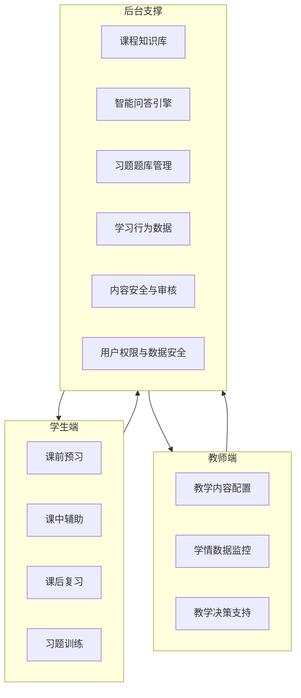

# 《计算机网络基础》课程智能体开发框架

## 一、文档依据与定位

- **功能框架**：[智能体功能框架图.txt](d:\src\QAStudio\智能体功能框架图.txt) 定义了三端（学生端 / 教师端 / 后台）模块划分与开发要点。
- **需求分析**：[智能体需求分析.txt](d:\src\QAStudio\智能体需求分析.txt) 明确了场景化需求、适配性要求与非功能需求。

智能体定位：**课程专属、电商场景化、轻量化** 的教学辅助，覆盖预习—课中—复习—习题全流程，面向经管电商专业。

---

## 二、总体架构（与文档对应）

- **学生端**：四大入口（预习 / 课中 / 复习 / 习题），全流程闭环。
- **教师端**：配置内容、查看学情、获取教学建议与导出数据。
- **后台**：知识库、问答、题库、行为数据、安全与权限，为双端提供统一能力。

---

## 三、分层框架建议

| 层次      | 内容                            | 对应文档要点                      |
| ------- | ----------------------------- | --------------------------- |
| **表现层** | 学生端 Web/移动端、教师端管理后台           | 界面简洁、四大入口、可视化数据面板、无安装、移动端友好 |
| **业务层** | 预习/课中/复习/习题流程编排，教师配置与学情统计     | 分场景需求、教学内容配置、学情监控与决策支持      |
| **能力层** | 问答引擎、PPT 解析与检索、习题推送与错题本、个性化推荐 | 知识库、问答、PPT 联动、分层习题、个性化复习    |
| **数据层** | 知识库（教材+PPT+电商案例）、题库、学习行为库     | 课程知识库、习题题库管理、学习行为数据记录       |
| **支撑层** | 权限、审计、内容审核、数据加密与备份            | 内容安全与审核、用户权限与数据安全           |

技术选型（已部分明确）：前端（如 Vue/React）+ **优先支持纯移动端浏览器**（可有 App 客户端）；后端（如 Node/Java/Python）；知识库与检索（如 RAG + 向量库）；部署**不限定校内网**，可公网部署，暂不接入学校统一身份认证；课中响应**不要求 1–2 秒实时**，若 5 秒内未完成 PPT 跳转则停止查找；单课堂并发按 **60–80 人** 设计架构与缓存策略。

---

## 四、核心能力与实现要点

1. **课程知识库**
  - 来源：教材、教学 PPT（教师上传 PPTX）、章节知识点、电商拓展（网络支付、电商架构、网络安全等）。
  - 已澄清：**教材与 PPT** 当前为教师上传的电子版 PPTX；章节、页码与教学大纲暂无一一对应表，**先根据每页备注文字进行识别、理解并关联**。**电商案例**：以文档或链接形式提供；教师可上传若干基础案例，智能体可在网上搜索类似案例；案例可改写或引用原文，引用原文时须提供出处链接。
2. **智能问答引擎**
  - 自然语言提问，答案简洁、不超纲，可关联 PPT 页码与知识点。
  - 建议：基于 RAG + 课程知识库，严格限定检索与生成范围；需设计「超纲检测」与「PPT 引用」输出格式。
3. **PPT 联动与知识点检索**
  - 能力：上传、解析（**优先利用每页备注文字做理解与关联**）、按章节/关键词/课堂进度检索与跳转；**先实现在线预览 PPT 某一页**（非打开本地/云盘文件）。
  - 已澄清：跳转目标为在线预览 PPT 的某一页；主要依据每页备注文字进行理解与关联。
4. **习题库与分层推送**
  - 三级难度（基础/应用/拓展），题目带解析、考点、PPT 对应位置。
  - 已澄清：**①** 有现成题库；可根据现有题目在网上查找相关知识，自动生成同知识点类似题目；自动建库时**各章节权重一致**，每次生成目标为**每章节 100 题、每知识点 20 题**。**②** 支持教师**手动录入题目与参考答案**，并可标记题目对应的知识点或章节。**③** 支持**按教师配置要求生成试卷**。
5. **个性化推荐与学情统计**
  - 基于预习、答题、提问数据做复习路径与习题推送；教师端可视化（预习完成率、高频问题、正确率、薄弱点、班级画像）；需区分**班级、学期、授课教师**等多班级/多学期维度。
6. **内容安全与审核**
  - 要求：知识点准确、无错误、无超纲；**内容由教师审核**；**新上线内容不需先审后发**。

---

## 五、难点与澄清（已确定）

### 5.1 资源与内容

| 问题 | 澄清结论 |
|------|----------|
| **教材与 PPT**：是否有电子版？章节、页码与教学大纲是否有一一对应表？ | 当前已有电子版 PPTX，由教师上传。章节、页码与教学大纲暂无一一对应表；**可先根据 PPT 每页备注里的文字进行识别、理解并关联**。 |
| **电商案例**：案例以何种形式提供？是否允许智能体直接引用原文或需改写？ | 提供**文档或链接**。需改写；教师可上传若干基础案例，智能体可在网上自动搜索类似案例并呈现。案例可**改写或引用原文**；若引用原文须**提供引用链接**。 |
| **题库**：是否已有现成题目？若需新建，优先章节与目标题量？ | **①** 有现成题目；可根据现有题目在网上查找相关知识，**自动生成同知识点类似题目**。自动新建题库时**各章节权重一致**，每次生成目标：**每章节 100 题、每知识点 20 题**。**②** 支持教师**手动输入题目和参考答案**，并可标记题目对应的知识点或章节。**③** 支持**按教师配置要求生成试卷**。 |

### 5.2 技术边界

| 问题 | 澄清结论 |
|------|----------|
| **「课中实时」**：课堂答疑与 PPT 定位是否必须 1–2 秒内？单课堂并发人数？ | **不必须**实时。若 **5 秒内**无法完成跳转查找则停止跳转。预计单课堂并发 **60–80 人**（据此设计架构与缓存策略）。 |
| **部署方式**：是否限定校内网/统一身份认证？是否必须支持纯移动端？ | **不限定**校内网，可公网部署。**暂不**与已有统一身份认证系统对接。**优先支持纯移动端浏览器**（可有 App 客户端）。 |
| **PPT 跳转**：在线预览某一页，还是打开本地/云盘并定位页码？ | **先实现在线预览 PPT 某一页**。可主要根据**每页的备注文字**进行理解与关联。 |

### 5.3 教师端与运营

| 问题 | 澄清结论 |
|------|----------|
| **内容自定义粒度**：教师可调整「章节开关、难度、题量」还是可编辑具体文案、题目与解析？ | 可调整的是 **「章节开关、难度、题量」** 级别。 |
| **多班级/多学期**：是否同一套智能体服务多班级、多学期？是否区分班级/学期/授课教师？ | **是**，需区分 **「班级」「学期」「授课教师」** 等维度。 |
| **反馈与迭代**：通过何种方式收集学生反馈？是否需要在产品内建反馈入口？ | 通过**问卷**方式；**需要在产品内建反馈入口**；最好能**同时通过对话模式**收集学生反馈意见。 |

### 5.4 安全与合规

| 问题 | 澄清结论 |
|------|----------|
| **学习数据**：哪些算「学习数据」？保存期限与脱敏策略？ | 学习数据包括：**答题记录、错题、提问内容**。**保存 6 个月**；脱敏采用 **标识匿名化** 处理方式。 |
| **内容审核**：由谁终审？新上线知识点或习题是否「先审后发」？ | 内容由**教师**审核；新上线内容**不需**先审后发。 |

---

## 六、建议的下一步

1. 技术栈与部署：按「公网、移动端优先、60–80 人并发、5 秒 PPT 跳转超时」落实技术选型与容量规划。
2. 知识库与 PPT：实现教师上传 PPTX、解析每页备注并做知识点关联；先支持在线预览到某一页。
3. 题库与组卷：在现成题目基础上实现「按知识点自动生成类似题」与教师手动录入、标记知识点/章节；实现按配置生成试卷。
4. 多维度运营：数据层与统计口径支持班级、学期、授课教师维度；产品内建反馈入口，并支持通过对话收集反馈。
5. 学习数据合规：答题记录、错题、提问内容保存 6 个月，采用标识匿名化；教师负责内容审核。

以上框架与澄清可直接作为开发与评审依据；可进一步细化到模块级接口、数据表结构和排期。